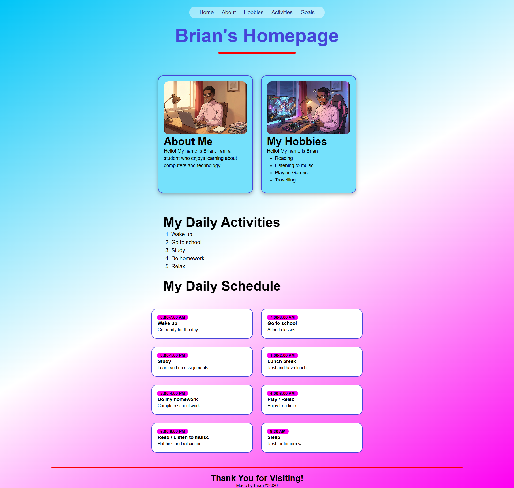
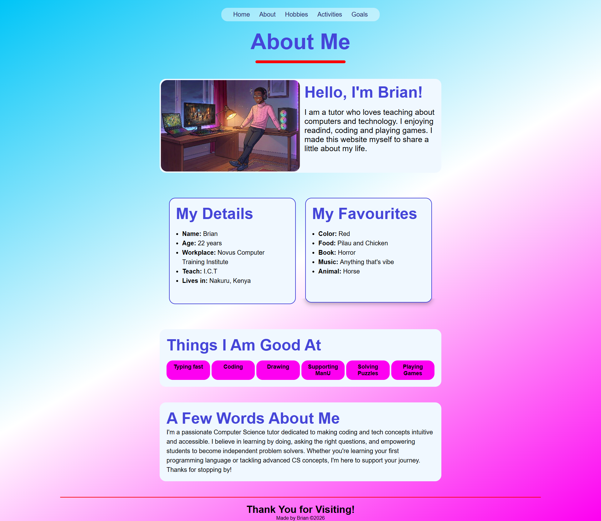
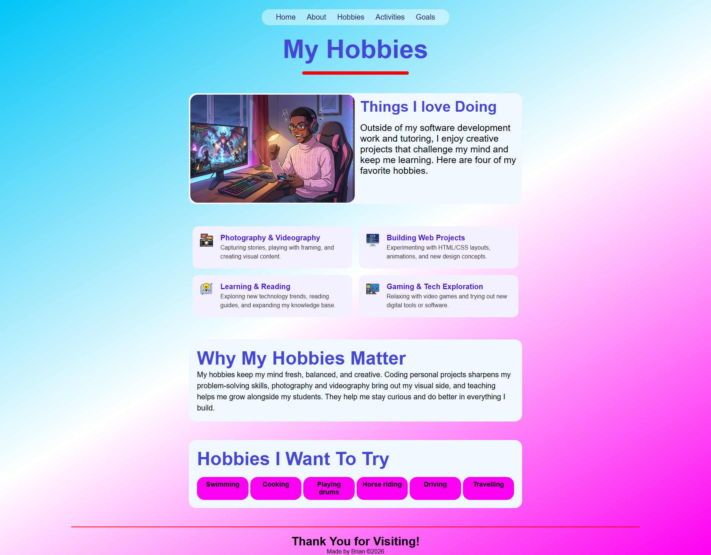
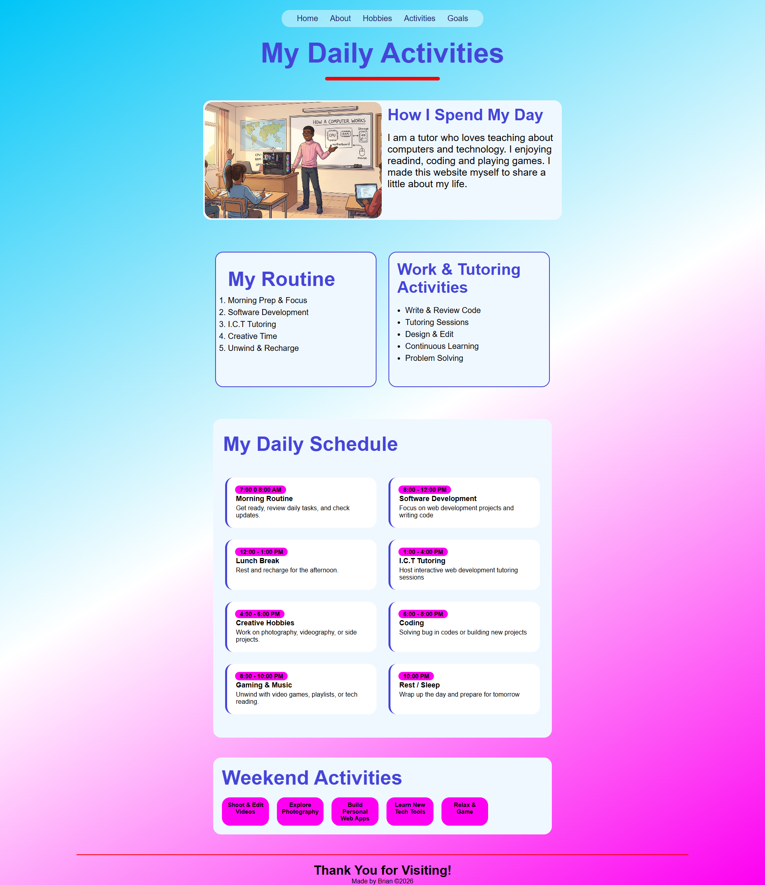
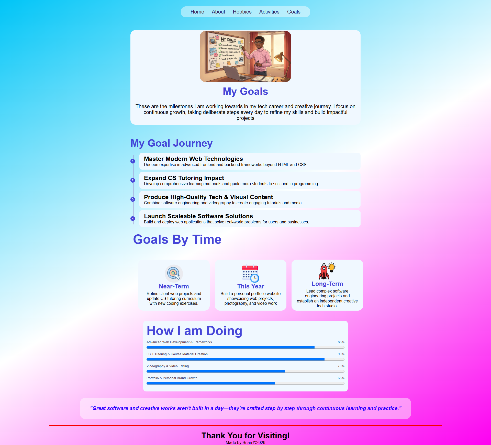
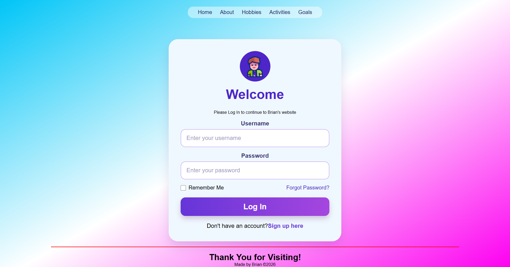

# 🌐 My Personal Portfolio — Learn HTML & CSS by Building

> A beginner-friendly, **multi-page personal portfolio website** built with nothing but **pure HTML5 and CSS3**.
> Created as a teaching project to help students take their very first steps into web design — no frameworks, no JavaScript libraries, no build tools. Just a text editor and a browser.


---

## 📖 Table of Contents

1. [About the Project](#-about-the-project)
2. [Preview](#-preview)
3. [The Pages](#-the-pages)
4. [Folder Structure](#-folder-structure)
5. [Getting Started](#-getting-started)
6. [Learning Path (Lesson by Lesson)](#-learning-path-lesson-by-lesson)
7. [Key Concepts Covered](#-key-concepts-covered)
8. [Student Challenges](#-student-challenges)
9. [Common Mistakes & Tips](#-common-mistakes--tips)
10. [Credits](#-credits)

---

## 🎯 About the Project

This project was designed to teach students **web design fundamentals using only HTML and CSS**, before they move on to JavaScript or frameworks.

Students build a small personal website made of **six linked pages**. Each page introduces one or two new ideas, so the skills grow step by step:

- **HTML** gives the page its _structure_ (headings, paragraphs, lists, images, links, forms).
- **CSS** gives the page its _style_ (colours, fonts, spacing, layout, rounded cards, gradients).

By the end, students will have a real portfolio they can personalise, show to friends and family, and later publish online.

---

## 🖼 Preview

|                Home                |                About                 |
| :--------------------------------: | :----------------------------------: |
|  |  |

|                Hobbies                 |                  Activities                  |
| :------------------------------------: | :------------------------------------------: |
|  |  |

|                Goals                |                Login                 |
| :---------------------------------: | :----------------------------------: |
|  |  |

---

## The Pages

Every page shares the same **pill-style navigation bar**, so students can move between pages and see how links work.

| Page           | File                     | Stylesheet         | What it teaches                                                         |
| -------------- | ------------------------ | ------------------ | ----------------------------------------------------------------------- |
| **Home**       | `webpages/index.html`    | `css/style.css`    | Page skeleton, semantic tags, header, nav bar, profile cards, footer    |
| **About**      | `webpages/about.html`    | `css/about.css`    | Paragraphs, images, text styling, two-column layout with Flexbox        |
| **Hobbies**    | `webpages/hobby.html`    | `css/hobby.css`    | Unordered lists (`<ul>`), icons/images, card grids                      |
| **Activities** | `webpages/activity.html` | `css/activity.css` | Ordered lists (`<ol>`), a daily schedule built with CSS Grid            |
| **Goals**      | `webpages/goal.html`     | `css/goal.css`     | Headings hierarchy, sections, backgrounds and gradients                 |
| **Login**      | `webpages/login.html`    | `css/login.css`    | HTML forms: `<form>`, `<label>`, `<input>`, `<button>` and styling them |

> ℹ️ The Login page is a **design exercise only**. It shows how to build and style a form. There is no backend, so nothing gets submitted or saved.

---

## Folder Structure

```text
portfolio/
│
├── webpages/               ← All HTML pages
│   ├── index.html          ← Home page (start here!)
│   ├── about.html
│   ├── hobby.html
│   ├── activity.html
│   ├── goal.html
│   └── login.html
│
├── css/                    ← One stylesheet per page
│   ├── style.css           ← Styles for the Home page
│   ├── about.css
│   ├── hobby.css
│   ├── activity.css
│   ├── goal.css
│   └── login.css
│
├── images/                 ← Illustrations, icons & screenshots
│   ├── brayo.png           ← Profile / hero illustration
│   ├── class.png  clock.png  comp.png  computer-game.png
│   ├── game.png  goal.png  idea.png  inovation.png
│   ├── photography.png  programming.png  schedule.png
│   └── homefinal.png  aboutfinal.png  hobbyfinal.png
│       finalactivity.png  goalfinal.png  loginfinal.png   ← Page screenshots (used in this README)
│
├── video/
│   └── boynew.gif          ← Animated illustration
│
└── README.md
```

### Why paths start with `../`

The HTML files live inside `webpages/`, while the CSS and images live in folders **next to** it. So from inside an HTML file you have to go **up one folder** (`../`) first:

```html
<!-- Inside webpages/index.html -->
<link rel="stylesheet" href="../css/style.css" />

```

Links between pages are in the **same folder**, so they don't need `../`:

```html
<a href="about.html">About</a>
```

---

## Getting Started

You only need **two things**:

1. A **code editor** — [VS Code](https://code.visualstudio.com/) is recommended (free).
2. A **web browser** — Chrome, Edge, Firefox or Safari.

### Steps

```bash
# 1. Download the project (or click "Code → Download ZIP" on GitHub)
git clone https://github.com/MELIODASbatman/Simple-portfolio.git

# 2. Open the folder in VS Code
cd Simple-portfolio
code .
```

3. Open `webpages/index.html` in your browser (double-click it, or right-click → _Open with_ → your browser).
4. 💡 **Tip:** Install the **Live Server** extension in VS Code, then right-click `index.html` → **Open with Live Server**. The page will refresh automatically every time you save.

---

## Learning Path (Lesson by Lesson)

Follow the pages in this order. Each lesson builds on the one before.

### Lesson 1 — The Home Page (`index.html` + `style.css`)

- Set up the basic HTML skeleton: `<!DOCTYPE html>`, `<html>`, `<head>`, `<body>`.
- Link a stylesheet with `<link>`.
- Use semantic tags: `<header>`, `<nav>`, `<main>`, `<section>`, `<footer>`.
- Build the **pill-shaped navigation bar** with `border-radius` and highlight the **active** link.
- Create the two **profile cards** (About Me + My Hobbies) side by side with **Flexbox**.

### Lesson 2 — About Page (`about.html` + `about.css`)

- Write paragraphs and headings about yourself.
- Add images with a helpful `alt` text.
- Put text and image next to each other, then learn how they **stack** on small screens.

### Lesson 3 — Hobbies Page (`hobby.html` + `hobby.css`)

- Use an **unordered list** `<ul>` when order doesn't matter.
- Pair each hobby with an illustration (gaming, programming, photography…).
- Style list items as cards with `padding`, `margin` and `box-shadow`.

### Lesson 4 — Activities Page (`activity.html` + `activity.css`)

- Use an **ordered list** `<ol>` when order **does** matter (a daily routine).
- Build a **daily schedule** with **CSS Grid**: time on the left, activity on the right.

### Lesson 5 — Goals Page (`goal.html` + `goal.css`)

- Organise content with a clear heading hierarchy (`h1` → `h2` → `h3`).
- Experiment with **linear gradients** and pastel colour palettes.

### Lesson 6 — Login Page (`login.html` + `login.css`)

- Build a form with `<form>`, `<label>`, `<input type="text">`, `<input type="password">` and `<button>`.
- Centre a card on the screen using Flexbox.
- Style focus states so users can see which input they are typing in.

---

## Key Concepts Covered

### HTML5

| Concept         | Tags / Examples                                                     |
| --------------- | ------------------------------------------------------------------- |
| Page structure  | `<!DOCTYPE html>`, `<html>`, `<head>`, `<body>`                     |
| Semantic layout | `<header>`, `<nav>`, `<main>`, `<section>`, `<article>`, `<footer>` |
| Text            | `<h1>`–`<h6>`, `<p>`, `<strong>`, `<em>`                            |
| Lists           | `<ul>`, `<ol>`, `<li>`                                              |
| Media           | ``, animated `.gif`                              |
| Links           | `<a href="">` between pages                                         |
| Forms           | `<form>`, `<label>`, `<input>`, `<button>`                          |

### CSS3

| Concept               | Properties / Examples                                    |
| --------------------- | -------------------------------------------------------- |
| Selectors             | element, `.class`, `#id`, `:hover`, `:focus`             |
| Box model             | `margin`, `padding`, `border`, `width`, `height`         |
| Colours & backgrounds | `color`, `background`, `linear-gradient()`               |
| Typography            | `font-family`, `font-size`, `font-weight`, `text-align`  |
| Rounded & soft UI     | `border-radius`, `box-shadow`                            |
| Flexbox               | `display: flex`, `justify-content`, `align-items`, `gap` |
| Grid                  | `display: grid`, `grid-template-columns`                 |
| Reusable colours      | CSS variables such as `--primary: #6c63ff;`              |
| Responsive design     | `@media (max-width: 768px) { ... }`                      |

---

## Student Challenges

Finished the lessons? Make the portfolio **yours** with these challenges:

- [ ] Change the colour palette using CSS variables.
- [ ] Replace all the text with information about **you**.
- [ ] Swap the images for your own drawings or photos.
- [ ] Add a new hobby to the Hobbies page.
- [ ] Add two more time slots to the daily schedule grid.
- [ ] Make every page look good on a phone using media queries.
- [ ] Add a `:hover` effect to the cards (for example, lift them up with `transform`).
- [ ] Create a brand-new **Contact** page and add it to the nav bar on every page.
- [ ] **Bonus:** Publish your site for free with **GitHub Pages**.

---

## Common Mistakes & Tips

| Problem                   | Likely cause            | Fix                                                              |
| ------------------------- | ----------------------- | ---------------------------------------------------------------- |
| CSS isn't loading         | Wrong path in `<link>`  | Check you used `../css/filename.css`                             |
| Image shows a broken icon | Wrong file name or path | File names are **case-sensitive** — `Game.png` ≠ `game.png`      |
| Nav link goes nowhere     | Typo in `href`          | Make sure it matches the file name exactly (e.g. `hobby.html`)   |
| Layout breaks on mobile   | Fixed widths in `px`    | Use `%`, `max-width` and media queries                           |
| Change doesn't show       | Browser cache           | Save the file, then refresh with `Ctrl + F5` / `Cmd + Shift + R` |

> **Pro tip:** Right-click any element in the browser → **Inspect** to open DevTools. You can see and edit CSS live!

---

## Credits

- Designed and built as a **teaching resource** for beginner web design classes.
- **All images and illustrations are AI-generated.**
- Built with using only **HTML5** and **CSS3**.
- Later I will add javascript and php

---

### License

This project is free to use for **learning and teaching**. Feel free to fork it, remix it and share it with your students.

> _"Every expert was once a beginner. Keep building!"_
